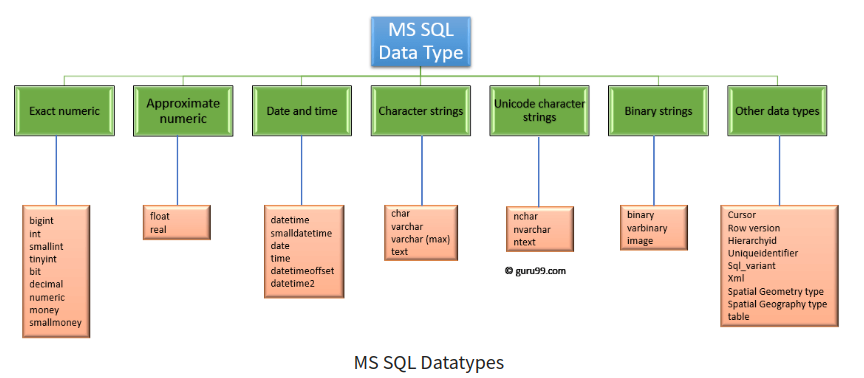

# MS SQL SERVER OVERVIEW

* ##### [ARCHITECTURE](#architecture)
* ##### [PHYSICALLY STORED](#physically-stored)
* ##### [TYPES](#types)

  

## [ARCHITECTURE](#architecture)

#### TDs: 
is the type of message that used to communicate between client and the server

 

#### Protocol Layer: 
The responsable part for determent the communtication type
##### Components:
###### SNI 
* Recive and send the `TDs` between server and client and also 
* Send Event and recive response from other `sql server` part 

 

#### Relation Engine:
The responsable part of processing the query and the result
##### Components:
###### CMD Parser:
* Recieve the `Language event` and scan the `query syntax`
* Create the `query tree` and send it to the `optimizer`

###### Optimizer:
* Create multiple `plan` to execute the query
* Choose the `cheapest` plan not the best one

###### Query Executer
* Recieve the `plan` from `optimizer` 
* Send the execution to `access-methods` 
* Rescieve result from `access-methods`
* Send the result to `SNI` and `SNI send it in form of TDs to client`

 

#### Storage engine:
The responsable part of dealing with storage
##### Components:
###### Access methods:
* Send query to the `Buffer Manager` if the query is `SELECT QUERY` and recieve data
* Send query to the `Transaction MAnager` if the query is `NON-SELECT QUERY` and recieve the response

###### Buffer manager:
* Check if the query is used before:
* * if the query used before the `buffer manger` gets the data directly from `cache memory` to improve the perfermence
* * if the query used before the `buffer manger` gets the data from `data file` and save the query in the `cache memory` in case to use again

###### Transaction manager:
* detect and log the exuction steps of `NON-SELECT` to used like rapport for execution
* call the `Lock manager`
* The `lock manager` add locks to each query to garantee the execution of each one without interupting by other querris

  

## [PHYSICALLY STORED](#physically-stored)

  

## [TYPES](#types)
